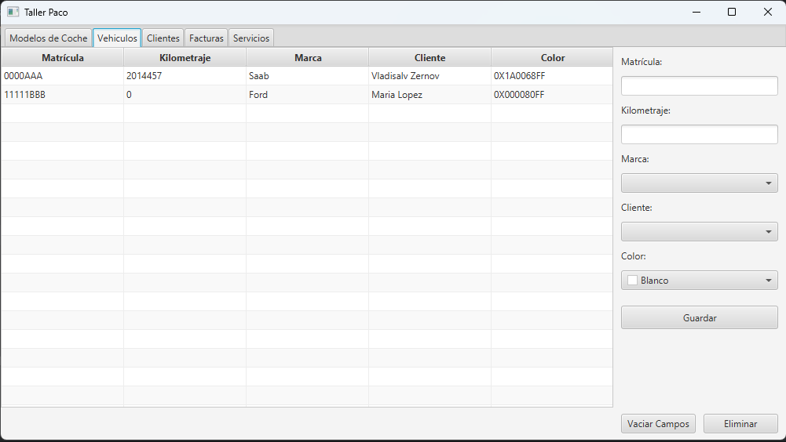

# Taller Paco

## Descripción

```
Pequeño proyecto hecho con java.

 - Incluye uso de JavaFX
 - Uso de Hibernate
 - Uso de JakartaPersistence
 - Uso de H2 Database
 - Uso de Lombok
```

## ER


## Entidades

````
 Todas las entidades **DEBEN** implementar ITEntity 

 - Client
 - Car     - includes Embeded - CarDetails
 - Invoice - includes Embeded PK - InvoicePK
 - Service
 - Brand   - inclides Lob as logo
````

## DAO

```
 - Incluye DAO para todas las entidades
 
 - ITEntity                                     ** Interface **
 - IDAO<T extends ITEntity>                     ** Interface **
 
 - DAO<T extends ITEntity> implements IDAO<T>   ** Clase Base de DAO **
 
 - ClientDAO extends DAO<Client>                
 - CarDAO extends DAO<Car>
 - InvoiceDAO extends DAO<Invoice>
 - ServiceDAO extends DAO<Service>
 - BrandDAO extends DAO<Brand>
    
```

## Dependecy Manager

```
 - Incluye un pequeño Dependency Manager:
 
 En base a un HashMap<Class<T>, IDAO<T>> se puede obtener los DAO registrados previamente.
 De esta manera se evita la continua inyección en constructores.
 
 Ejemplo de uso que se puede encontrar en los controladores y en el Main.java:
```

````java
import com.zervladpy.tallerpaco.Core.DAO.ClientDAO;
import com.zervladpy.tallerpaco.Core.Entities.Client.Client;
import com.zervladpy.tallerpaco.Core.Utils.Managers.DependencyManager;
import jakarta.persistence.EntityManager;
import com.zervladpy.tallerpaco.Core.Utils.Managers.ServiceManager;

DependencyManager dp = DependencyManager.getInstance();
/* Registro de Instancia*/
dp.add(EntityManager.class, ServiceManager.getInstance());
/* Obtencion de Instancia*/
dp.get(EntityManager.class);

/* NOTA: No se pueden registrar dos instancias iguales
 *       - Si se proced se lanzará un RuntimeException
 *       - En el caso de que no exista la instancia se lanzará un RuntimeException
 *  */
````

## Aplicación

```
 - Incluye CRUD para todas las entidades
 - Incluye querys personalizadas
 - Incluye uso de DTOS
```

### Imágenes

- **brand-view**


- **car-view**



- **client-view**


- **invoice-view**


- **service-view**


