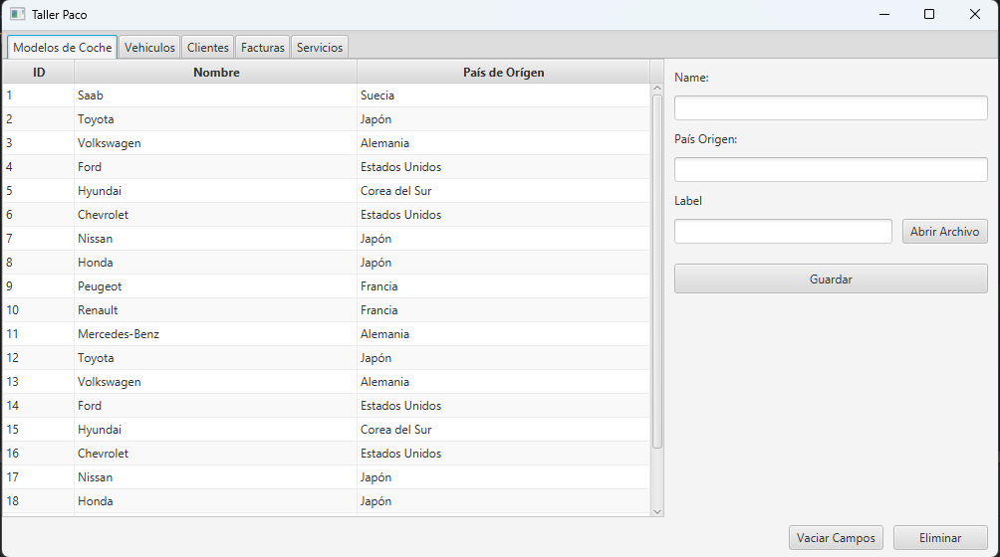
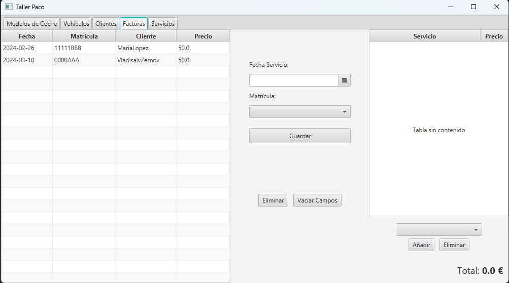

# Taller Paco

## Descripción

```
Pequeño proyecto hecho con java.

 - Incluye uso de JavaFX
 - Uso de Hibernate
 - Uso de JakartaPersistence
 - Uso de H2 Database
 - Uso de Lombok
```

## ER


## Entidades

````
 Todas las entidades **DEBEN** implementar ITEntity 

 - Client
 - Car     - includes Embeded - CarDetails
 - Invoice - includes Embeded PK - InvoicePK
 - Service
 - Brand   - inclides Lob as logo
````

## DAO

```
 - Incluye DAO para todas las entidades
 
 - ITEntity                                     ** Interface **
 - IDAO<T extends ITEntity>                     ** Interface **
 
 - DAO<T extends ITEntity> implements IDAO<T>   ** Clase Base de DAO **
 
 - ClientDAO extends DAO<Client>                
 - CarDAO extends DAO<Car>
 - InvoiceDAO extends DAO<Invoice>
 - ServiceDAO extends DAO<Service>
 - BrandDAO extends DAO<Brand>
    
```

## Aplicación

```
 - Incluye CRUD para todas las entidades
 - Incluye querys personalizadas
 - Incluye uso de DTOS
```

### Imágenes

- **brand-view**



- **car-view**


- **client-view**


- **invoice-view**



- **service-view**


